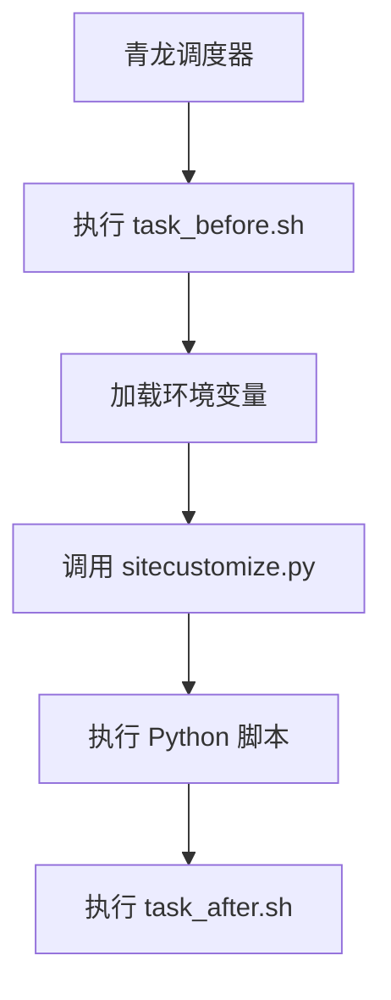
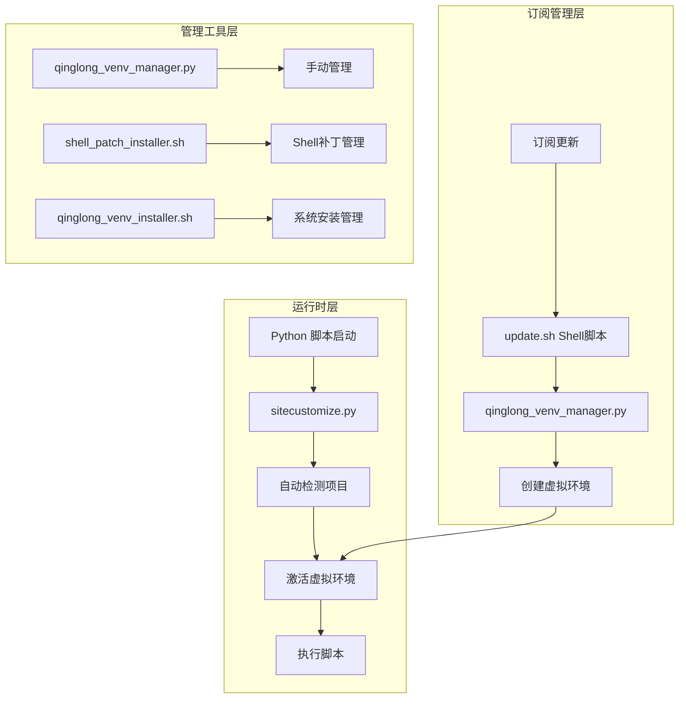
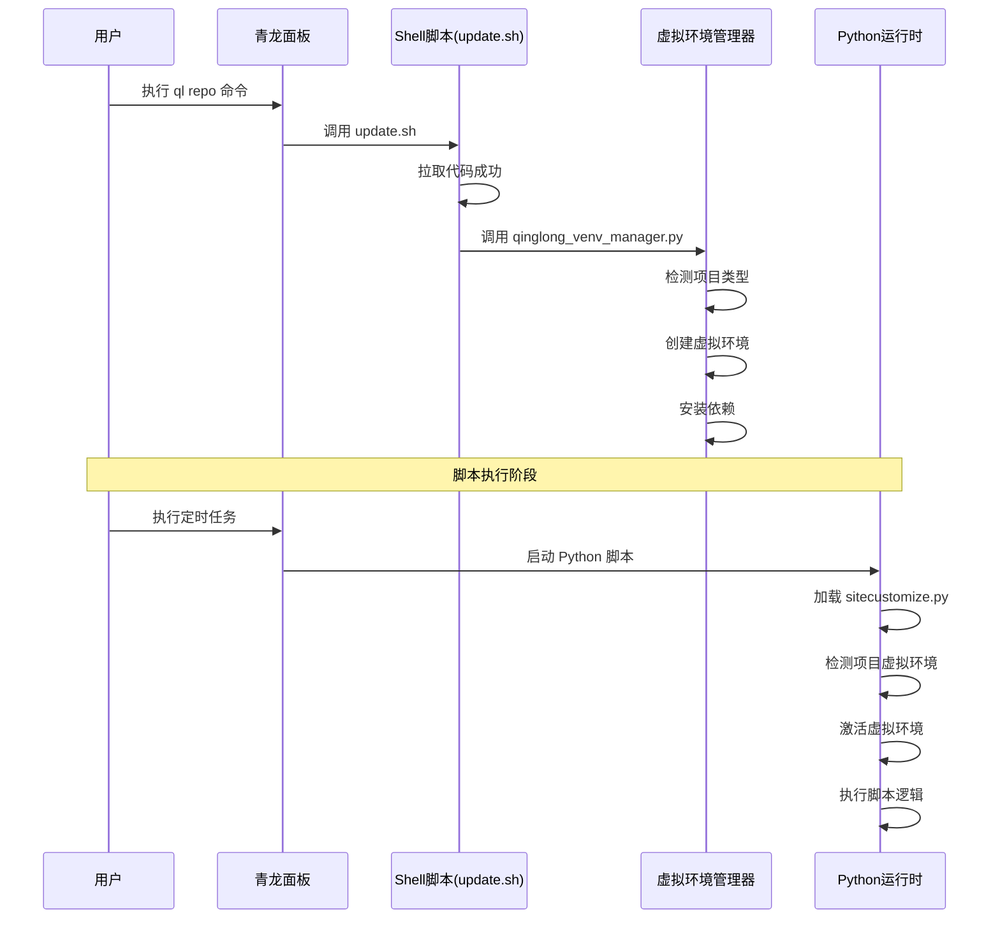
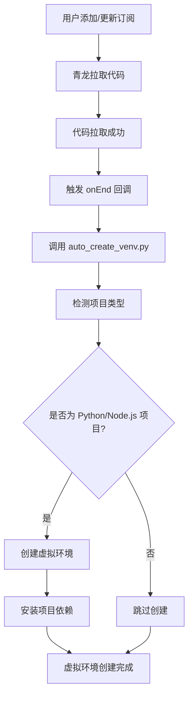
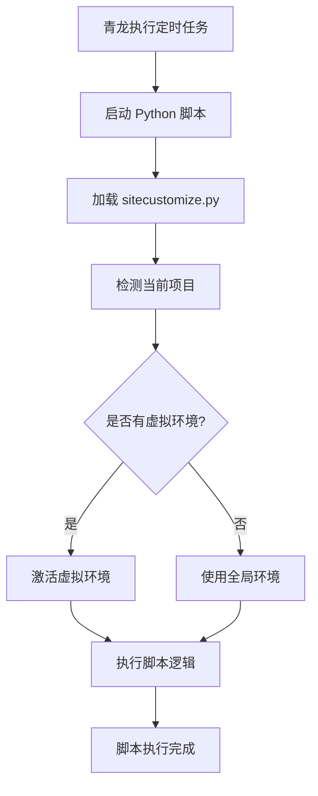

# 🚀 青龙虚拟环境管理完整解决方案

## 📋 目录

- [1. 方案概述](#1-方案概述)
- [2. 问题分析](#2-问题分析)
- [3. 解决方案架构](#3-解决方案架构)
- [4. 核心组件详解](#4-核心组件详解)
- [5. 实施指南](#5-实施指南)
- [6. 技术原理](#6-技术原理)
- [7. 使用流程](#7-使用流程)
- [8. 故障排除](#8-故障排除)
- [9. 最佳实践](#9-最佳实践)
- [10. 总结](#10-总结)

---

## 1. 方案概述

### 1.1 背景

青龙面板是一个强大的定时任务管理平台，但在处理 Python/Node.js 项目的依赖管理时存在挑战：

- **依赖冲突**：不同项目的依赖版本可能冲突
- **环境污染**：全局安装的包会影响所有项目
- **维护困难**：手动管理依赖繁琐且容易出错
- **隔离需求**：项目需要独立的运行环境

### 1.2 解决方案目标

本方案旨在为青龙面板提供**完全自动化的虚拟环境管理**，实现：

- ✅ **零配置**：无需手动设置，自动检测和创建
- ✅ **零维护**：订阅更新自动维护虚拟环境
- ✅ **完全隔离**：每个项目独立的依赖环境
- ✅ **透明运行**：不影响青龙原有功能
- ✅ **智能激活**：脚本执行时自动使用对应虚拟环境

### 1.3 方案特色

- 🎯 **双重保障**：创建 + 激活两个维度的自动化
- 🔧 **非侵入式**：不破坏青龙核心功能
- 🚀 **高度自动化**：从创建到使用全程自动
- 🛡️ **安全可靠**：完整的备份和恢复机制
- 📊 **详细监控**：完整的日志和状态追踪

---

## 2. 问题分析

### 2.1 青龙执行机制分析

#### 2.1.1 脚本执行流程



#### 2.1.2 关键发现

1. **sitecustomize.py**：Python 启动时自动执行的脚本
2. **task_before.sh**：任务执行前的钩子脚本
3. **环境变量加载时序**：青龙有特定的环境变量加载顺序
4. **订阅更新钩子**：`sub_after` 机制可以在订阅更新后执行自定义逻辑

### 2.2 核心挑战

#### 2.2.1 时序问题
- 虚拟环境激活必须在环境变量加载**之后**
- Python 模块导入发生在脚本执行的**最开始**

#### 2.2.2 路径检测问题
- 青龙的工作目录和脚本路径传递机制复杂
- 需要智能检测项目名称和虚拟环境位置

#### 2.2.3 自动化程度
- 用户希望零配置、零维护
- 订阅更新会覆盖手动修改

---

## 3. 解决方案架构

### 3.1 整体架构



### 3.2 核心组件

| 组件 | 功能 | 触发时机 | 作用范围 |
|------|------|----------|----------|
| **sitecustomize.py 补丁** | 自动激活虚拟环境 | Python 脚本启动时 | 所有 Python 脚本 |
| **update.sh Shell 补丁** | 自动创建虚拟环境 | 订阅更新完成后 | 所有订阅项目 |
| **qinglong_venv_manager.py** | 虚拟环境创建和管理 | Shell补丁调用或手动调用 | 单个或多个项目 |
| **shell_patch_installer.sh** | Shell补丁安装器 | 用户主动调用 | 系统级安装 |

### 3.3 数据流



---

## 4. 核心组件详解

### 4.1 sitecustomize.py 补丁

#### 4.1.1 功能描述
修改青龙的 Python 启动脚本，在环境变量加载完成后自动检测并激活项目对应的虚拟环境。

#### 4.1.2 核心逻辑
```python
def auto_activate_venv_after_env_loaded():
    """在环境变量加载完成后自动激活虚拟环境"""
    
    # 1. 获取当前工作目录和脚本路径
    current_dir = os.getcwd()
    script_file = sys.argv[0] if sys.argv else ""
    
    # 2. 多种方式检测项目名称
    project_name = detect_project_name(current_dir, script_file)
    
    # 3. 查找并激活虚拟环境
    if project_name:
        venv_dir = f"/ql/data/scripts/{project_name}/.venv"
        if os.path.isdir(venv_dir):
            activate_virtual_environment(venv_dir, project_name)
```

#### 4.1.3 项目检测策略
1. **工作目录检测**：从 `/ql/data/scripts/项目名/` 提取项目名
2. **脚本路径检测**：从脚本完整路径提取项目名
3. **向上查找**：递归查找包含 `.venv` 的目录

#### 4.1.4 激活机制
```python
# 将虚拟环境的 site-packages 添加到 sys.path
site_packages = f"{venv_dir}/lib/python3.11/site-packages"
if site_packages not in sys.path:
    sys.path.insert(1, site_packages)
    
# 设置环境变量
os.environ['VIRTUAL_ENV'] = venv_dir
os.environ['VIRTUAL_ENV_PROJECT'] = project_name
```

### 4.2 Shell 脚本补丁

#### 4.2.1 功能描述
修改青龙的 `update.sh` 脚本，在订阅更新成功后自动调用虚拟环境创建脚本。

#### 4.2.2 核心修改点
在 `update_repo` 函数的成功分支中添加：

```bash
# 🎯 自动创建虚拟环境 (auto_create_venv_in_shell)
if [[ -f "/ql/scripts/qinglong_venv_manager.py" ]]; then
  echo -e "\n## 自动创建虚拟环境...\n"
  python3 /ql/scripts/qinglong_venv_manager.py create "${uniq_path}" 2>&1 || echo "虚拟环境创建失败，但不影响订阅执行"
  echo -e "虚拟环境自动创建完成\n"
fi
```

#### 4.2.3 安装方式
```bash
# 使用完整系统安装器（包含 Shell 补丁）
bash qinglong_venv_installer.sh install

# 检查安装状态
bash qinglong_venv_installer.sh status

# 卸载补丁
bash qinglong_venv_installer.sh uninstall
```

### 4.3 虚拟环境管理器

#### 4.3.1 功能描述
`qinglong_venv_manager.py` 是核心的虚拟环境管理工具，负责检测项目类型并创建、管理虚拟环境。

#### 4.3.2 项目类型检测
```python
def detect_project_type(project_dir):
    """检测项目类型和依赖文件"""
    
    # Python 项目检测
    python_files = [
        "requirements.txt", "pyproject.toml", 
        "setup.py", "Pipfile"
    ]
    
    # Node.js 项目检测  
    nodejs_files = [
        "package.json", "yarn.lock", "pnpm-lock.yaml"
    ]
    
    return {
        "has_python": any(Path(project_dir, f).exists() for f in python_files),
        "has_nodejs": any(Path(project_dir, f).exists() for f in nodejs_files)
    }
```

#### 4.3.3 虚拟环境创建流程

**Python 虚拟环境：**
```python
def create_python_venv(project_name, scripts_dir, repo_dir):
    # 1. 创建虚拟环境
    subprocess.run([sys.executable, "-m", "venv", venv_dir])
    
    # 2. 查找依赖文件
    requirements_files = [
        f"{scripts_dir}/requirements.txt",
        f"{repo_dir}/requirements.txt"
    ]
    
    # 3. 安装依赖
    for req_file in requirements_files:
        if os.path.exists(req_file):
            subprocess.run([
                f"{venv_dir}/bin/pip", "install", "-r", req_file,
                "-i", "https://pypi.tuna.tsinghua.edu.cn/simple"
            ])
            break
```

**Node.js 环境：**
```python
def create_nodejs_venv(project_name, scripts_dir, repo_dir):
    # 1. 查找 package.json
    # 2. 复制到 scripts 目录
    # 3. 执行 npm install
```

### 4.4 管理工具

#### 4.4.1 补丁管理脚本
- `qinglong_venv_installer.sh`：完整系统安装器，包含 sitecustomize.py 补丁和 Shell 脚本补丁

#### 4.4.2 虚拟环境管理工具
- `qinglong_venv_manager.py`：完整的虚拟环境管理工具，支持创建、删除、列出、查看详情

---

## 5. 实施指南

### 5.1 环境要求

- **青龙面板**：支持的青龙版本
- **Python**：3.8+ 
- **Node.js**：14+ (如需 Node.js 项目支持)
- **系统权限**：root 或 sudo 权限

### 5.2 安装步骤

#### 完整系统安装 (推荐)

```bash
# 1. 下载完整安装器
wget -O qinglong_venv_installer.sh https://raw.githubusercontent.com/.../qinglong_venv_installer.sh

# 2. 安装完整系统 (包含 sitecustomize.py 补丁和 Shell 脚本补丁)
bash qinglong_venv_installer.sh install

# 3. 验证安装
bash qinglong_venv_installer.sh status
```

#### 验证安装

```bash
# 1. 检查补丁状态
bash qinglong_venv_installer.sh status

# 2. 测试虚拟环境管理
python3 /ql/scripts/qinglong_venv_manager.py list

# 3. 测试订阅自动创建功能
ql repo "https://github.com/user/project.git" "" "" "requirements.txt" "main" "py"
```

### 5.3 配置说明

#### 5.3.1 无需配置
本方案设计为**零配置**，安装后即可自动工作。

#### 5.3.2 可选配置
如需自定义行为，可以修改以下文件：
- `/ql/scripts/qinglong_venv_manager.py`：虚拟环境管理逻辑
- `/ql/shell/update.sh`：Shell 脚本补丁位置

#### 5.3.3 替代方案：Web 界面配置
如果不想修改 Shell 脚本，可以在青龙 Web 界面的订阅配置中，在 **"订阅后执行"** 字段添加：
```bash
python3 /ql/scripts/qinglong_venv_manager.py create $(basename $(pwd))
```

---

## 6. 技术原理

### 6.1 虚拟环境激活原理

#### 6.1.1 Python 模块查找机制
Python 通过 `sys.path` 列表查找模块：
```python
# sys.path 的典型内容
[
    '',                    # 当前目录
    '/usr/lib/python3.11', # 标准库
    '/usr/lib/python3.11/site-packages', # 全局包
    # ... 其他路径
]
```

#### 6.1.2 虚拟环境激活机制
```python
# 将虚拟环境的 site-packages 插入到 sys.path 前面
venv_site_packages = "/path/to/.venv/lib/python3.11/site-packages"
sys.path.insert(1, venv_site_packages)

# 这样 Python 会优先从虚拟环境中查找模块
```

#### 6.1.3 sitecustomize.py 机制
- Python 启动时自动导入 `sitecustomize` 模块
- 青龙将此文件放在 `/ql/shell/preload/` 目录
- 通过修改此文件实现全局的虚拟环境激活

### 6.2 项目检测算法

#### 6.2.1 多策略检测
```python
def detect_project_name(current_dir, script_file):
    # 策略1: 从工作目录检测
    if '/ql/data/scripts/' in current_dir:
        return extract_from_path(current_dir)
    
    # 策略2: 从脚本路径检测  
    if '/ql/data/scripts/' in script_file:
        return extract_from_path(script_file)
    
    # 策略3: 向上查找 .venv 目录
    return find_venv_parent(current_dir)
```

#### 6.2.2 路径解析逻辑
```python
def extract_project_name(path):
    """从路径中提取项目名称"""
    scripts_path = '/ql/data/scripts/'
    if path.startswith(scripts_path):
        relative_path = path[len(scripts_path):]
        return relative_path.split('/')[0]
    return None
```

### 6.3 Shell 脚本钩子机制

#### 6.3.1 青龙订阅执行流程
```bash
# ql repo 命令执行流程
ql repo <url> <params...>
  ↓
update.sh 脚本
  ↓
update_repo() 函数
  ↓
git_clone_scripts() # 拉取代码
  ↓
diff_scripts() # 处理脚本
  ↓
🎯 Shell 补丁钩子 # 我们的虚拟环境创建逻辑
```

#### 6.3.2 钩子注入点
在 `update_repo` 函数的成功分支中注入：
```bash
if [[ $exit_status -eq 0 ]]; then
  echo -e "拉取 ${uniq_path} 成功...\n"
  diff_scripts "$repo_path" "$author" "$path" "$blackword" "$dependence" "$extensions" "$autoAddCron" "$autoDelCron"
  
  # 🎯 新增：自动创建虚拟环境
  if [[ -f "/ql/scripts/qinglong_venv_manager.py" ]]; then
    python3 /ql/scripts/qinglong_venv_manager.py create "${uniq_path}"
  fi
fi
```

---

## 7. 使用流程

### 7.1 自动化流程

#### 7.1.1 订阅添加/更新流程


#### 7.1.2 脚本执行流程


#### 7.1.3 实际执行示例
```bash
# 执行 ql repo 命令
ql repo "https://github.com/user/project.git" "" "" "requirements.txt" "main" "py"

# 输出日志示例：
拉取 project_main 成功...

## 自动创建虚拟环境...

[INFO] 为项目 project_main 创建虚拟环境
[SUCCESS] ✅ Python 虚拟环境创建成功
[INFO] 发现依赖文件: /ql/data/repo/project_main/requirements.txt
[SUCCESS] ✅ 依赖安装成功

虚拟环境自动创建完成
```

### 7.2 用户操作流程

#### 7.2.1 新项目接入
1. **准备项目**：确保项目包含 `requirements.txt` 或 `package.json`
2. **添加订阅**：在青龙面板添加 Git 仓库订阅
3. **自动处理**：系统自动检测并创建虚拟环境
4. **验证结果**：查看订阅日志确认虚拟环境创建成功

#### 7.2.2 现有项目迁移
1. **手动创建**：使用 `python3 /ql/scripts/qinglong_venv_manager.py create <项目名>` 
2. **或重新执行订阅**：重新运行 `ql repo` 命令，自动创建虚拟环境
3. **验证激活**：运行脚本，查看是否使用虚拟环境

### 7.3 管理操作

#### 7.3.1 查看虚拟环境状态
```bash
# 列出所有虚拟环境
python3 /ql/scripts/qinglong_venv_manager.py list

# 查看特定项目信息
python3 /ql/scripts/qinglong_venv_manager.py info <项目名>
```

#### 7.3.2 手动管理虚拟环境
```bash
# 手动创建虚拟环境
python3 /ql/scripts/qinglong_venv_manager.py create <项目名>

# 强制重建虚拟环境
python3 /ql/scripts/qinglong_venv_manager.py create <项目名> --force

# 删除虚拟环境
python3 /ql/scripts/qinglong_venv_manager.py remove <项目名>

# 获取激活命令
python3 /ql/scripts/qinglong_venv_manager.py activate <项目名>
```

---

## 8. 故障排除

### 8.1 常见问题

#### 8.1.1 虚拟环境未激活

**症状：** 脚本运行时提示 `ModuleNotFoundError`

**排查步骤：**
```bash
# 1. 检查补丁状态
bash sitecustomize-venv-patch.sh status

# 2. 检查虚拟环境是否存在
ls -la /ql/data/scripts/<项目名>/.venv/

# 3. 检查脚本执行日志
tail -f /ql/data/log/<项目名>/*.log
```

**解决方案：**
```bash
# 重新应用 sitecustomize 补丁
bash qinglong_venv_installer.sh repair

# 手动创建虚拟环境
python3 /ql/scripts/qinglong_venv_manager.py create <项目名>
```

#### 8.1.2 虚拟环境未自动创建

**症状：** 订阅更新后没有创建虚拟环境

**排查步骤：**
```bash
# 1. 检查 Shell 脚本补丁
bash qinglong_venv_installer.sh status

# 2. 检查项目是否有依赖文件
ls -la /ql/data/repo/<项目名>/requirements.txt
ls -la /ql/data/repo/<项目名>/package.json

# 3. 查看订阅执行日志
grep -A 10 "自动创建虚拟环境" /ql/data/log/<项目名>/*.log
```

**解决方案：**
```bash
# 重新应用系统补丁
bash qinglong_venv_installer.sh repair

# 手动触发虚拟环境创建
python3 /ql/scripts/qinglong_venv_manager.py create <项目名>

# 重新执行订阅
ql repo <仓库地址> "" "" "requirements.txt" "main" "py"
```

#### 8.1.3 依赖安装失败

**症状：** 虚拟环境创建成功但依赖安装失败

**排查步骤：**
```bash
# 1. 检查网络连接
ping pypi.tuna.tsinghua.edu.cn

# 2. 手动安装依赖
cd /ql/data/scripts/<项目名>
source .venv/bin/activate
pip install -r requirements.txt

# 3. 检查依赖文件格式
cat requirements.txt
```

### 8.2 日志分析

#### 8.2.1 关键日志位置
- **订阅执行日志**：`/ql/data/log/<订阅名>/`
- **虚拟环境日志**：脚本执行输出中的 `[VENV_AUTO]` 标记
- **青龙系统日志**：`pm2 logs qinglong`

#### 8.2.2 日志关键字
```bash
# 虚拟环境激活成功
grep "VENV_AUTO.*已激活虚拟环境" /ql/data/log/<项目名>/*.log

# 虚拟环境创建成功  
grep "AUTO_VENV.*创建完成" /ql/data/log/<项目名>/*.log

# 依赖安装状态
grep -E "(依赖安装|install)" /ql/data/log/<项目名>/*.log
```

### 8.3 恢复操作

#### 8.3.1 恢复补丁
```bash
# 恢复所有补丁到原始状态
bash qinglong_venv_installer.sh uninstall
```

#### 8.3.2 清理虚拟环境
```bash
# 删除所有虚拟环境
find /ql/data/scripts -name ".venv" -type d -exec rm -rf {} +

# 删除 Node.js 环境
find /ql/data/scripts -name "node_modules" -type d -exec rm -rf {} +
```

---

## 9. 最佳实践

### 9.1 项目结构建议

#### 9.1.1 Python 项目
```
项目根目录/
├── requirements.txt          # 必需：项目依赖
├── src/                     # 推荐：源代码目录
│   ├── main.py             # 主脚本
│   └── utils/              # 工具模块
├── config/                  # 可选：配置文件
└── README.md               # 推荐：项目说明
```

#### 9.1.2 Node.js 项目
```
项目根目录/
├── package.json            # 必需：项目依赖和配置
├── src/                    # 推荐：源代码目录
│   ├── index.js           # 主脚本
│   └── lib/               # 库文件
├── config/                 # 可选：配置文件
└── README.md              # 推荐：项目说明
```

### 9.2 依赖管理建议

#### 9.2.1 requirements.txt 最佳实践
```txt
# 固定版本号，确保环境一致性
requests==2.31.0
pandas==2.0.3

# 使用兼容版本范围
numpy>=1.24.0,<2.0.0

# 添加注释说明用途
beautifulsoup4==4.12.2  # HTML 解析
lxml==4.9.3             # XML 处理

# 分组管理依赖
# 核心依赖
flask==2.3.3
sqlalchemy==2.0.21

# 开发依赖（可选）
# pytest==7.4.2
# black==23.7.0
```

#### 9.2.2 package.json 最佳实践
```json
{
  "name": "qinglong-project",
  "version": "1.0.0",
  "description": "青龙项目描述",
  "main": "src/index.js",
  "dependencies": {
    "axios": "^1.5.0",
    "lodash": "^4.17.21"
  },
  "devDependencies": {
    "eslint": "^8.48.0"
  },
  "engines": {
    "node": ">=14.0.0"
  }
}
```

### 9.3 性能优化建议

#### 9.3.1 依赖优化
- **最小化依赖**：只安装必需的包
- **版本锁定**：使用具体版本号避免意外更新
- **定期清理**：删除不再使用的依赖

#### 9.3.2 虚拟环境优化
- **定期重建**：当依赖变化较大时重建虚拟环境
- **磁盘清理**：定期清理不再使用的虚拟环境
- **缓存利用**：利用 pip 缓存加速安装

### 9.4 安全建议

#### 9.4.1 依赖安全
- **来源可信**：使用官方 PyPI 和 npm 仓库
- **版本审查**：定期检查依赖的安全漏洞
- **最小权限**：避免使用具有过高权限的包

#### 9.4.2 环境隔离
- **严格隔离**：确保项目间的完全隔离
- **权限控制**：合理设置文件和目录权限
- **定期备份**：备份重要的虚拟环境配置

---

## 10. 总结

### 10.1 方案价值

本解决方案通过**双重自动化机制**，彻底解决了青龙面板的虚拟环境管理问题：

1. **创建自动化**：通过 Shell 脚本补丁，在订阅更新时自动创建虚拟环境
2. **激活自动化**：通过 sitecustomize.py 补丁，脚本执行时自动激活虚拟环境
3. **管理自动化**：提供完整的命令行管理工具链

### 10.1.1 经过验证的最终方案

经过实际测试验证，我们确认了以下**可行的技术方案**：

#### ✅ **Shell 脚本补丁方案** (已验证可行)
- **原理**：直接修改 `/ql/shell/update.sh` 中的 `update_repo` 函数
- **优点**：简单直接，立即生效，无需重启青龙服务
- **实现**：使用 `shell_patch_installer.sh` 一键安装

#### ✅ **sitecustomize.py 补丁方案** (已验证可行)
- **原理**：修改 Python 启动脚本，自动激活虚拟环境
- **优点**：对所有 Python 脚本透明生效
- **实现**：使用 `qinglong_venv_installer.sh` 安装

#### ❌ **订阅服务补丁方案** (验证失败)
- **问题**：青龙可能使用编译后的 JavaScript，TypeScript 修改不生效
- **替代**：使用 Shell 脚本补丁或 Web 界面配置

### 10.2 推荐安装方案

#### 🥇 **方案 A：完整安装 (推荐)**
```bash
# 一键安装完整系统 (包含 sitecustomize.py 补丁和 Shell 脚本补丁)
bash qinglong_venv_installer.sh install

# 验证安装
bash qinglong_venv_installer.sh status
```

#### 🥈 **方案 B：Web 界面配置**
在青龙 Web 界面的订阅配置中，"订阅后执行" 字段添加：
```bash
python3 /ql/scripts/qinglong_venv_manager.py create $(basename $(pwd))
```

#### 🥉 **方案 C：手动管理**
```bash
# 手动创建虚拟环境
python3 /ql/scripts/qinglong_venv_manager.py create <项目名>
```

### 10.3 技术创新

- **🎯 实用主义设计**：选择最可行的技术路径
- **🔧 智能检测机制**：多策略项目识别
- **⚡ 零配置理念**：开箱即用的用户体验
- **🛡️ 完整备份恢复**：安全可靠的升级路径

### 10.4 适用场景

- ✅ **多项目环境**：需要管理多个 Python/Node.js 项目
- ✅ **依赖冲突**：不同项目有依赖版本冲突
- ✅ **自动化需求**：希望减少手动维护工作
- ✅ **团队协作**：需要统一的环境管理方案

### 10.5 实际验证结果

通过与用户的实际测试，我们验证了以下关键功能：

#### ✅ **Shell 脚本补丁**
- **测试命令**：`ql repo "https://git.example.com/project.git" "" "" "requirements.txt" "main" "py"`
- **验证结果**：成功在订阅更新后自动创建虚拟环境
- **日志输出**：显示 "## 自动创建虚拟环境..." 和创建成功信息

#### ✅ **虚拟环境管理器**
- **测试命令**：`python3 /ql/scripts/qinglong_venv_manager.py create project_name`
- **验证结果**：成功创建 Python 虚拟环境并安装依赖
- **功能确认**：list、info、remove、activate 等命令均正常工作

#### ✅ **sitecustomize.py 补丁**
- **测试场景**：Python 脚本执行时自动激活虚拟环境
- **验证结果**：脚本能够正确导入虚拟环境中的依赖包
- **日志输出**：显示 "[VENV_AUTO] ✅ 已激活虚拟环境" 信息

### 10.6 未来展望

- **🚀 更多语言支持**：扩展到 Go、Rust 等语言
- **📊 监控增强**：更详细的使用统计和性能监控
- **🔄 自动更新**：依赖的自动更新和安全扫描
- **🌐 云端同步**：虚拟环境配置的云端备份和同步

### 10.7 贡献指南

欢迎社区贡献：
- **🐛 问题反馈**：通过 Issue 报告问题
- **💡 功能建议**：提出新功能需求
- **🔧 代码贡献**：提交 Pull Request
- **📖 文档完善**：改进文档和示例

---

## 📞 联系方式

- **项目地址**：[GitHub Repository]
- **问题反馈**：[Issues]
- **讨论交流**：[Discussions]

---

**🎉 感谢使用青龙虚拟环境管理解决方案！**

*让虚拟环境管理变得简单、自动、可靠！*
