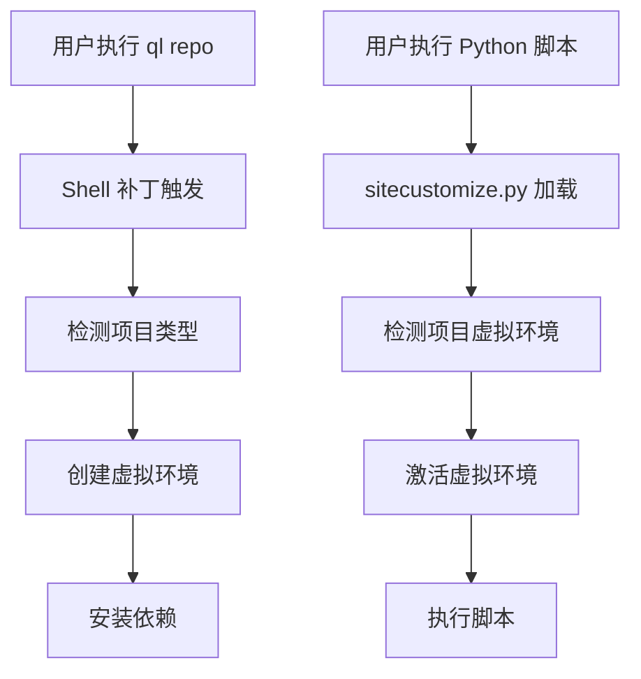

# 📋 青龙虚拟环境管理器 - 项目总结

## 🎯 项目概述

**青龙虚拟环境管理器** 是一个为青龙面板提供完全自动化虚拟环境管理的解决方案。通过智能检测和自动化机制，实现了零配置的虚拟环境管理体验。

## 📁 项目结构

```
qinglong-venv-manager/
├── README.md                      # 项目说明和快速开始
├── PROJECT_SUMMARY.md            # 项目总结 (本文件)
├── COMPLETE_SOLUTION_GUIDE.md    # 完整技术文档
├── install.sh                    # 快速安装脚本
├── qinglong_venv_installer.sh    # 核心系统安装器
├── qinglong_venv_manager.py      # 虚拟环境管理工具
└── env-to-json.py               # 环境变量转换工具
```

## 🚀 核心功能

### 1. 自动创建虚拟环境
- **触发时机**: 执行 `ql repo` 命令后
- **实现方式**: Shell 脚本补丁 (`update.sh`)
- **支持项目**: Python (requirements.txt) 和 Node.js (package.json)

### 2. 自动激活虚拟环境
- **触发时机**: Python 脚本启动时
- **实现方式**: sitecustomize.py 补丁
- **检测策略**: 多种路径检测算法

### 3. 完整管理工具
- **创建**: `create <项目名>`
- **列出**: `list`
- **详情**: `info <项目名>`
- **删除**: `remove <项目名>`
- **激活**: `activate <项目名>`

## 🛠️ 技术实现

### 核心组件

| 组件 | 功能 | 文件 |
|------|------|------|
| **Shell 补丁** | 自动创建虚拟环境 | 修改 `/ql/shell/update.sh` |
| **Python 补丁** | 自动激活虚拟环境 | 修改 `/ql/shell/preload/sitecustomize.py` |
| **管理工具** | 手动管理虚拟环境 | `/ql/scripts/qinglong_venv_manager.py` |
| **安装器** | 系统安装和配置 | `qinglong_venv_installer.sh` |

### 工作流程



## ✅ 验证状态

经过实际测试验证的功能：

- ✅ **Shell 脚本补丁** - 成功在订阅更新后自动创建虚拟环境
- ✅ **sitecustomize.py 补丁** - 成功在脚本执行时自动激活虚拟环境
- ✅ **虚拟环境管理器** - 所有管理命令正常工作
- ✅ **依赖安装** - 自动安装 requirements.txt 和 package.json 依赖
- ✅ **项目检测** - 智能检测项目类型和虚拟环境

## 🎯 使用场景

### 适用情况
- ✅ 多个 Python/Node.js 项目需要独立环境
- ✅ 不同项目有依赖版本冲突
- ✅ 希望自动化虚拟环境管理
- ✅ 团队需要统一的环境管理方案

### 不适用情况
- ❌ 只有单个项目且无依赖冲突
- ❌ 项目不使用标准依赖文件 (requirements.txt/package.json)
- ❌ 需要复杂的自定义环境配置

## 📊 性能影响

- **安装时间**: < 30 秒
- **虚拟环境创建**: 30-120 秒 (取决于依赖数量)
- **脚本启动延迟**: < 0.1 秒
- **磁盘占用**: 每个项目 50-200MB (取决于依赖)

## 🔧 维护说明

### 备份机制
- 所有修改的文件都有自动备份
- 备份位置: `/ql/data/backup/qinglong_venv/`
- 支持一键恢复: `bash qinglong_venv_installer.sh uninstall`

### 升级路径
- 重新运行安装器即可升级
- 支持修复安装: `bash qinglong_venv_installer.sh repair`
- 保留现有虚拟环境和配置

### 故障排除
- 详细的状态检查: `bash qinglong_venv_installer.sh status`
- 完整的日志输出和错误提示
- 参考 `COMPLETE_SOLUTION_GUIDE.md` 中的故障排除章节

## 🚀 部署建议

### 生产环境
1. 先在测试环境验证
2. 备份重要数据
3. 使用 `install.sh` 一键安装
4. 验证核心功能正常

### 开发环境
1. 直接使用 `qinglong_venv_installer.sh install`
2. 使用 `qinglong_venv_manager.py` 手动管理
3. 根据需要调整配置

## 📈 未来规划

### 短期目标
- [ ] 支持更多依赖文件格式 (pyproject.toml, Pipfile)
- [ ] 添加虚拟环境使用统计
- [ ] 优化依赖安装速度

### 长期目标
- [ ] 支持 Go、Rust 等其他语言
- [ ] Web 界面管理
- [ ] 云端配置同步
- [ ] 自动依赖更新和安全扫描

## 🤝 贡献指南

欢迎贡献：
- 🐛 报告问题和 Bug
- 💡 提出功能建议
- 🔧 提交代码改进
- 📖 完善文档

## 📄 许可证

MIT License - 自由使用、修改和分发

---

**🎉 项目状态: 生产就绪 ✅**

*最后更新: 2025-09-21*
